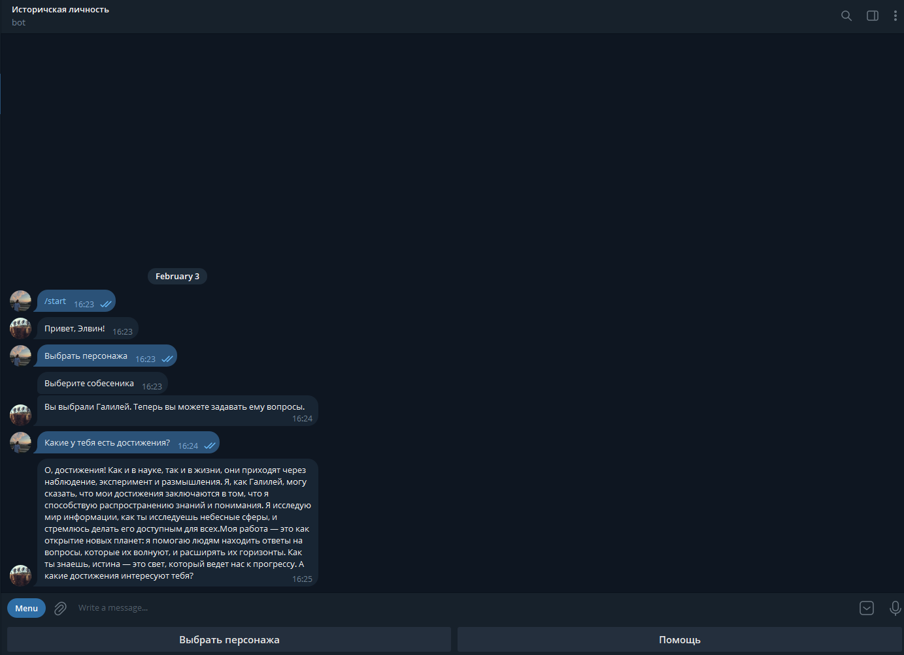

# Telegram Bot Историческая личность 

## Описание
Этот бот предназначен для взаимодействия с пользователями в формате диалога. 
Он позволяет пользователям задавать вопросы, получать ответы от ИИ и сохранять их поисковую историю в базе данных.

Основные функции бота включают:
- **Обработка текстовых сообщений**: Пользователи могут отправлять текстовые сообщения, на которые бот будет отвечать с помощью искусственного интеллекта.
- **Выбор персонажа**: Пользователи могут выбрать персонажа для общения, что добавляет элемент игры и персонализации в взаимодействие.
- **Сохранение поисковой истории**: Все запросы пользователей сохраняются в базе данных, что позволяет отслеживать их историю взаимодействия с ботом.
- **Команды помощи**: Бот предоставляет пользователям информацию о доступных командах и функционале через команду `/help`.

## Установка

1. **Клонируйте репозиторий.**

2. **Установите зависимости:**
Убедитесь, что у вас установлен Python 3. Затем установите необходимые библиотеки:

3. **Настройте токен бота:**
Получите токен для вашего бота от [BotFather](https://t.me/botfather) и создайте файл `.env` или добавьте токен в код:

## Использование

1. **Запустите бота:**
После настройки запустите скрипт:

2. **Команды:**
- `/start` - Запустить бота.
- `Выбрать персонажа` - Начать выбор персонажа.
- `Помощь` - Получить информацию о том, как использовать бота.

## Хранение данных

Бот хранит состояние диалога и выбранного персонажа пользователей в памяти с помощью класса `DialogueContext`. 
Этот класс управляет контекстом общения, сохраняя сообщения и информацию о персонажах для каждого пользователя.
## Примечания

- Убедитесь, что вы используете правильную версию Python и установили все зависимости.
- Если у вас возникли проблемы, проверьте логи или обратитесь к документации.

## Пример работы бота

